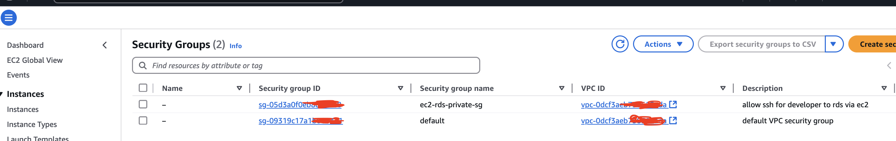
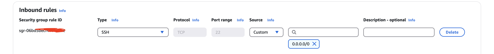
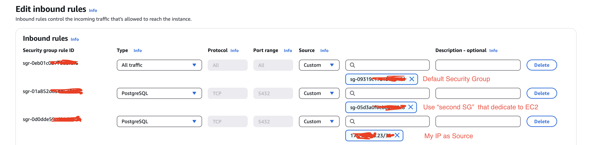
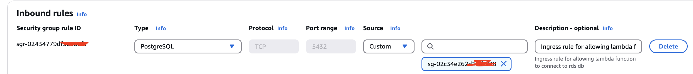
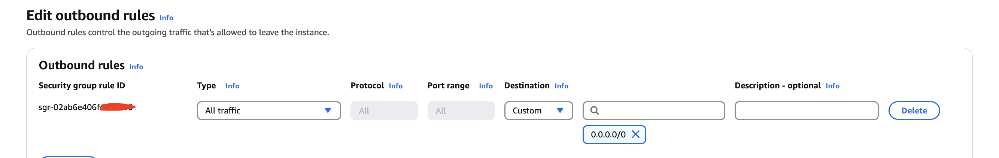
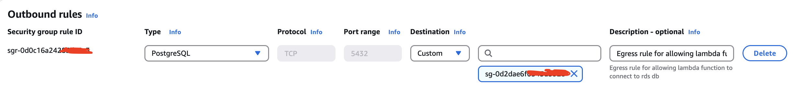
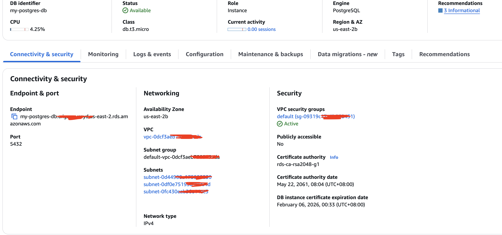
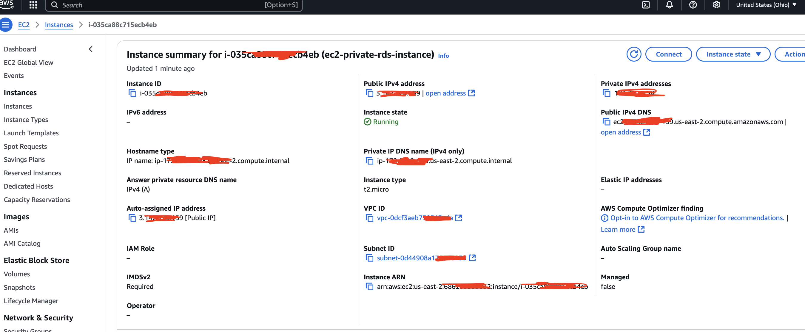
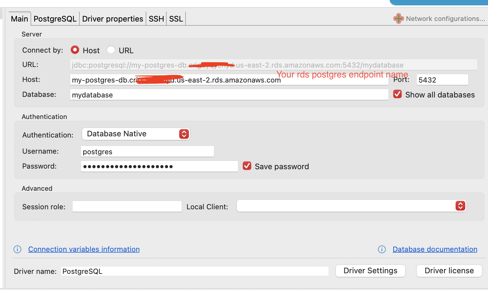

# Creating RDS Postgres and Lambda 
- Disclaimer: Im using both default and custom VPC for the creation of RDS either public accessible or private network

### Steps

- **Custom VPC**
    - Create this instance if you planned for private vpc only. By default create a new vpc will create a **default** security group too
    - select VPC and more
    - create custom CIDR IPv4 vpc range
    - for me i create :
        - 2 AZ, 2 public and 2 private subnets for each AZ
        - NAT and VPC not needed
    - finish 

- **Security Group**
    - Theory:
        - there will be two security group to make the connection work. What we are trying to achieve is to create a secured SSH tunnel connection from local SQL IDE such as Dbeaver to connect to private host RDS postgres
        - example of our goal to create two security group as image below:
        
        - why two security group? Because for private connection, user from outside network such as my laptop cannot access directly access RDS Postgres and must use EC2 as intermediary (thru means of SSH tunnel)
        - So thats why there will be two security groups since there is two service use here (EC2 instance and RDS Postgres)
        - First security group is the default security group that I will use to setup inbound and outbound for RDS postgres
        - Second security group is to setup inbound for EC2 taht only allow SSH connection
    - Practical:
        - To go to security group, either:
            - click on security group ID from RDS Postgres instance
            - go to EC2 -> security group
        - alter **default** security group
            - edit inbound rule
                - rule 1:
                    - Type: All traffic
                    - Source: Custom
                    - use default security group
                - rule 2:
                    - Type: PostgreSQL
                    - Port: 5432
                    - Source: My IP
            - edit outbound rule
                - Ensure it's set to 0.0.0.0/0 (Allow all traffic)
            
        - if to create private vpc:
            - create **new** security group
                - edit inbound rule
                - example dedicated "second" security group ec2 inbound:
                
                - after created this "second" security group, (first is the default SG), edit the default security group inbound by adding it as:
                    - Type: PostgreSQL
                    - Source: Custom
                    - use ec2 "second" security group                    
                - example overall created inbound
                
                - for rds, make sure to create a new security group to receive inbound request from lambda as below:
                
                - edit outbound rule
                    - Ensure it's set to 0.0.0.0/0 (Allow all traffic)
                    - example for both private or public is same for outbound as below
                
                    - for lambda, make sure to create outbound rule to enable reach rds as below:
                    
    - finish

- **RDS Postgres**
    - if planned for private VPC, make sure to create subnet group before rds db instance
        - vpc -> use custom VPC
        - AZ -> select based on how manay AZ declared when creating VPC
        - subnet -> make sure to select all private subnet only from created subnets list
    - create a new RDS postgres
    - give a name to the instance identifier.i.e. "postgres-rds"
    - credentials - self manage (remeber username and master password)
    - choose free tier spec such as:
        - db.t3.micro
        - General Purpose SSD (20gb storage allocation)
    - connectivity : 
        - default vpc
        - db subnet group will foloow default vpc
        - if public
            - tick public access
        - if private
            - tick no
    - VPC security group : existing 
        - if public:
            - select default
        - if private:
            - select custom built vpc
            - then select subnet that is created in earlier step (in first line for privtae VPC RDS)
    - Allow inbound traffic on port 5432 from your IP or Lambda CIDR
    - Additional configuration for database
        - create a default database (not necessarily) such as "mydatabase"
    - Other config leave as default
    - example rds overview:
    
    - finish

- **EC2 instance**
    - Create this instance if you planned for private vpc only 
    - launch new instance
    - give name to the instance
    - leave amazon linux image and if not mention means left as it is
    - create new key pair
        - give name for key pair
        - key pari type : RSA
        - private key format .pem (remember where it is downloaded since it is use to setup in dbeaver later)
    - select existing security group -> use the "second" security group dedicated for EC2 (which focus on ssh)
    - example ec2 instance summary:
    
    - finish

- **Lambda**
    - create new lambda instance
    - give lambda function name, runtime (choose slightly lower python version just in case. i.e. 3.9)
    - change default execution role -> create new role with basic lambda permission
    - additional configuration:
        - enable vpc -> sleect default vpc
        - select all subnet within the default vpc
        - security group -> select default security group
    - attached sample code to test connection. Example: [sample-lambda-script](lambda_connection.py)
    - when edit or just paste new code, make sure to click deploy to save changes onto your lambda
    - edit in lambda menu for environment variable required. Example:
        ```
        DB_HOST = RDS Endpoint (e.g., mydb.xxxxxxx.us-east-1.rds.amazonaws.com)
        DB_USER = postgres
        DB_PASSWORD = Your RDS password
        DB_NAME = mydatabase
        DB_PORT = 5432
        ```
    - add layer -> create new layer -> (in my case i just specify an arn since someone already create) [example arn based on suitable python version and region](https://github.com/jetbridge/psycopg2-lambda-layer)
        ```
        arn:aws:lambda:us-east-2:898466741470:layer:psycopg2-py39:1
        ```
    - or you can create a new custom layer like:
        - create lambda layer locally (a zip file for that required library). Example:
            ```
            mkdir python
            pip install psycopg2-binary -t python/
            zip -r psycopg2-layer.zip python/
            ```
        - Upload the "zipped" psycopg2-layer.zip and attach it to your function.
    - Test the lambda function. (No need for any json input. delete the template input and click test). if ok sould see "200" code
    - finish

- **DBeaver**
    - create connection
    - specify as image below in main tab
    
    - if private vpc
        - need additional setup besides the main tab for configuration setting
        - go to tab "SSH" in connection setting (as in imae above)
        - HOST/IP : use EC2 instance "Public IPv4 DNS" 
        - Port : 22
        - User name : just give any i.e. EC2-user
        - authentication method : public key
        - private key: upload the downloaded .pem key
        - test tunnel configuration -> click ok even if warning/error -> see if connected status
    - finish